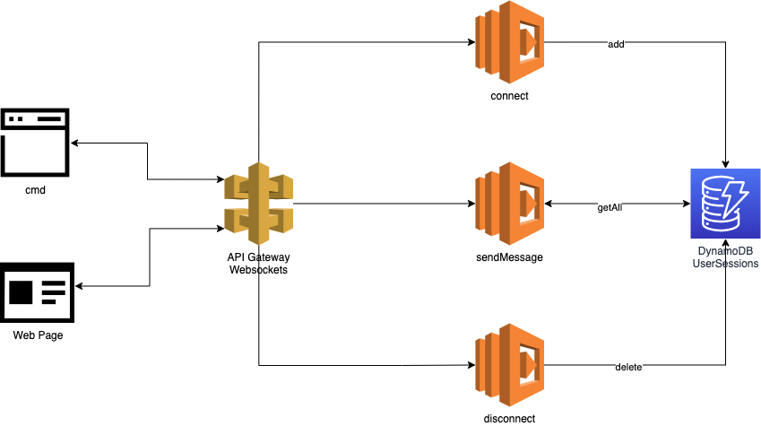

# aws-go-chat-service
Chat Service built in Go, API Gateway and AWS Lambda using Serverless Framework

# Application Architecture


# Steps
## All started with a basic setup
```
serverless create -t aws-go-mod
```

# References
* https://medium.com/swlh/real-time-chat-application-with-aws-websockets-7f06b833f02c

* https://medium.com/@cristiano.ventura/create-a-real-time-chat-service-with-go-api-gateway-and-lambda-959f8c9752e6
